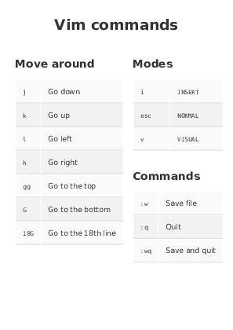

# Markdown Cheater

Markdown Cheater is the combination of a simple shell script and some CSS to allow for easy cheatsheets creation using markdown. It is using [pandoc](https://pandoc.org/) to generate the pdf and [ImageMagick' convert](http://www.imagemagick.org/script/convert.php) for the images.



## Pattern

To create your own cheatsheets you should use this pattern:
```markdown
<div class="cheatContainer">

	<div class="cheat">
		## Move around
		|| 
		|-|-
		<kbd>j</kbd>| Go down 
		<kbd>k</kbd>| Go up
		<kbd>l</kbd>| Go left
		<kbd>h</kbd>| Go right
	</div>

	<div class="cheat">
		## Commands
		|| 
		|-|-
		`:w`| Save file 
		`:q`| Quit
		`:wq`| Save and quit
	</div>

</div>
```

Everything you want to be styled as a cheatsheet should be wrapped in the `<div class="cheat">` container and each section should be wrapped in a `<div class="cheat">` container.

Of course outside of the `<div class="cheatContainer">` you can use normal markdown.

## Usage

```sh
./generate.sh -i INPUT.md [-o OUTPUT.pdf] [-c IMAGE.png] [--papersize a3]
```

## Dependencies

- [pandoc](https://pandoc.org/): pdf generation
- [ImageMagick' convert](http://www.imagemagick.org/script/convert.php) (optional): image generation

## I don't like how it looks !

You can just plug about anything on the css. If you want to force the mosaic effect, you can play with this line on the `style.css` file:
```css
:root {
  --page-height: calc(2 * 1150px); 
}
```
The `1150px` is close to the height of one page in the defautl configuration. That means here it should wrap on two a4 pages.